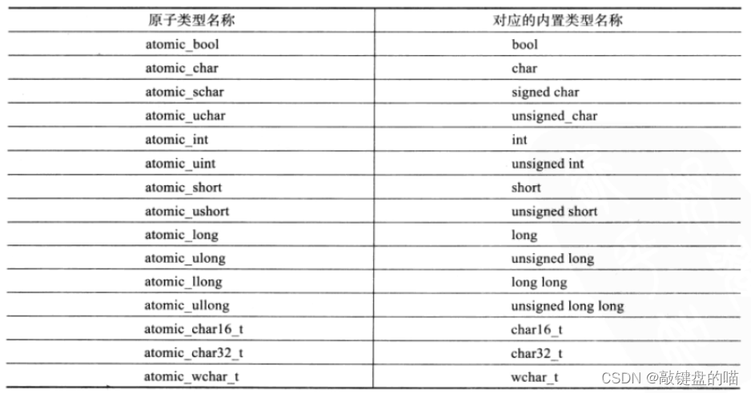

# 基础知识
## 宏定义 
    #宏定义字符串化
    ##字符串连接
## 变量
全局变量 作用域整个工程，使用extern导出
静态全局变量 static，定义在源文件中，作用域该源文件，如果定义在头文件中，包含一次就有一个变量
## 内联函数
会在编译阶段进行替换，多次调用会导致程序文件过大。
## sizeof
struct中存在数据对齐问题
内存在起始地址的编码必须是成员类型所占字节数的整数倍
sizeof是结构体中占用空间最多的成员所占空间的整数倍
## 内存
delete 和 delete[] 
自定义数据结构数组使用delete[],否则只会调用第一个元素的析构
建议new/delete使用，new[]/delete[]使用

## main函数
int main(int argc,char* argv[])

## 指针
字符数组 char test[]="strig"; 存储在栈中
字符指针 char *test = "string"; 存储在常量区，相同的常量只有一份拷贝
函数变量中的数组参数实际是指针 int test(char str1[],char str2[]);
指针可以自增和自减，数组名不可以
### 指针和句柄
句柄是windows中的一个概念吗，保存着资源在资源注册列表中的一个索引
### 指针常量和常量指针
指针常量：指针的类型是一个常量，指向地址不可改变 int * const p
常量指针：指针指向的内容不可变 const int* p / int const * p

### 指针数组和数组指针
指针数组：int *p[3];
数组指针：int(*p)[3], 指向数组的地址 a[10], p=&a;

### 数组地址和数组首元素地址
数组名等于数组首元素的地址，a[10] 即a = &a[0],
数组地址和数组首元素地址数值相同，含义不同
数组地址为 &a,即*(&a)=&a[0]

### 函数指针
int max(int,int);
int (*p)(int,int)=max
最常见的用途为参数传递

### this指针和空指针的概念
CTest为类
CTest *pTest=NULL;
pTest->fun1(); 编译器转化为=>CTest::fun1(NULL);

### 引用&
引用的初始化并不是值的拷贝，作为函数参数使用
常量引用const int &a=10

## 内存管理
数据区通常分为：栈存储区，堆存储区、全局及静态存储区、常量存储区
空间默认几M空间，向内存地址减小的方向使用，堆空间向内存地址增大的方向使用

## 函数重载
C++支持函数重载因为C++在编译过程中会对函数进行重命名。
重命名函数名=返回值类型+ 作用域+ 原始函数名+ 参数列表
使用extern "C",原因：不使用extern "C",编译器会按照重命名后的函数名称查找函数
父类中有一组重载的函数，子类重写其中一个时，其他函数对于子类是不可见的。

# 提高篇
## 类中使用const
const 成员变量： const char a;必须通过构造函数初始化列表进行初始化 baby(char b):a(b){},初始化后a的值不能更改
const 成员函数 char geta() const{return a;},表示在函数中不能修改对象的数据成员。
## 构造函数
系统会自动生成一个无参构造函数和一个拷贝构造函数
**构造函数初始化列表为空，系统会默认执行初始化列表中自动初始化数据成员**

# C++11新特性
## 新增声明

1. auto
2. decltype 获取表达式类型 decltype(x+y) sum,声明sum变量，类型为变量x+y的结果类型

## 新增容器
1. unordered_map
2. unordered_set

### 容器新增方法
std::vector::emplace_back
std::vector::push_back
std::map::insert
std::map::emplace

## 右值引用
&& 

## 新增默认成员函数
- 构造函数
- 析构函数
- 拷贝构造函数
- 拷贝赋值重载
- 取地址重载
- const取地址重载

## 可变模板参数
```C++
template <class ...Args>
void ShowList(Args... args)
```
## 线程
线程对象不能拷贝，可以转移
### 原子操作库

可以使用atomic类模板，定义出需要的任意原子类型。
atmoic<T> t;   // 声明一个类型为T的原子类型变量t

使用atomic作为map.value,示例如下：
```C++
#include <atomic>
#include <map>
#include <memory>

using atomic_ptr_t = std::shared_ptr<std::atomic<int64_t>>;
typedef std::map<uint64_t, atomic_ptr_t> value_map_t;

int main()
{
    value_map_t map;
    map[1] = atomic_ptr_t(new std::atomic<int64_t>(0));

    return 0;
}
```
或者
```C++
#include <atomic>
#include <map>
#include <memory>


using atomic_ptr_t = std::shared_ptr<std::atomic<int64_t>>;
typedef std::map<uint64_t, atomic_ptr_t> value_map_t;


int main()
{
    value_map_t map;
    map[1] = atomic_ptr_t(new std::atomic<int64_t>(0));

    return 0;
}
```

### 锁
#### mutex 普通锁
- lock()
- unlock()
- try_lock()

>> 如果当前互斥量没有被其他线程占有，则该线程锁住互斥量，直到该线程调用 unlock释放互斥量。
如果当前互斥量被其他线程锁住，则当前调用线程返回 false，而并不会被阻塞掉。
如果当前互斥量被当前调用线程锁住，则会产生死锁(deadlock)。
#### recursive_mutex 递归锁
允许同一个线程对互斥量多次上锁（即递归上锁）
#### timed_mutex
- try_lock_for()
  - 接受一个时间范围，表示在这一段时间范围之内线程如果没有获得锁则被阻塞住（与std::mutex 的 try_lock() 不同，try_lock 如果被调用时没有获得锁则直接返回false），如果在此期间其他线程释放了锁，则该线程可以获得对互斥量的锁，如果超时（即在指定时间内还是没有获得锁），则返回 false
- try_lock_until()
  - 接受一个时间点作为参数，在指定时间点未到来之前线程如果没有获得锁则被阻塞住，如果在此期间其他线程释放了锁，则该线程可以获得对互斥量的锁，如果超时（即在指定时间内还是没有获得锁），则返回 false
#### recursive_timed_mutex

### lock_guard
构造时加锁，析构时解锁
### unique_lock
lock、try_lock、try_lock_for、try_lock_until、unlock
### 条件变量condition_variable
