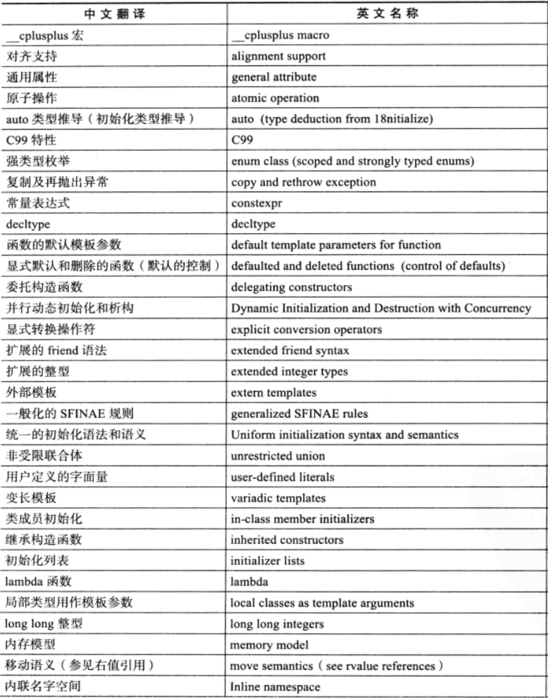
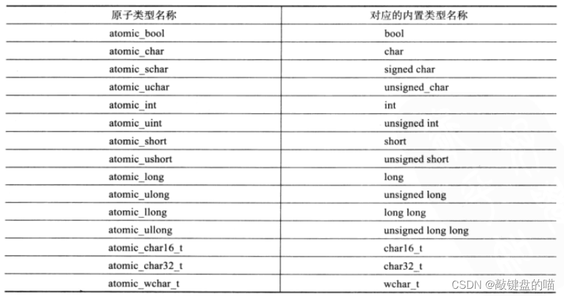

# C++11新特性

## 新增声明
1. auto
   可以简化代码
```C++
eg:
std::vector<std::string> array;
std::vector<std::string>::iterator it = array.begin();
// auto
auto it = array.begin();
```

2. decltype 获取表达式类型 decltype(x+y) sum,声明sum变量，类型为变量x+y的结果类型

## 新增容器
1. unordered_map
   通过Key访问元素比map快，遍历效率低。底层实现为hash，相同的Key放图同一个hash桶中
   - iterator find(const K& key),返回key在哈希桶中的位置
   - size_t count(const K& key),返回哈希桶中关键码为key的键值对的个数
2. unordered_set

### 容器新增方法
std::vector::emplace_back
std::vector::push_back
std::map::insert
std::map::emplace

## 右值引用
&& 

## 新增默认成员函数
- 构造函数
- 析构函数
- 拷贝构造函数
- 拷贝赋值重载
- 取地址重载
- const取地址重载

## 可变模板参数
```C++
template <class ...Args>
void ShowList(Args... args)
```

## 线程
线程对象不能拷贝，可以转移
### 原子操作库

可以使用atomic类模板，定义出需要的任意原子类型。
atmoic<T> t;   // 声明一个类型为T的原子类型变量t

使用atomic作为map.value,示例如下：
```C++
#include <atomic>
#include <map>
#include <memory>

using atomic_ptr_t = std::shared_ptr<std::atomic<int64_t>>;
typedef std::map<uint64_t, atomic_ptr_t> value_map_t;

int main()
{
    value_map_t map;
    map[1] = atomic_ptr_t(new std::atomic<int64_t>(0));

    return 0;
}
```
或者
```C++
#include <atomic>
#include <map>
#include <memory>


using atomic_ptr_t = std::shared_ptr<std::atomic<int64_t>>;
typedef std::map<uint64_t, atomic_ptr_t> value_map_t;


int main()
{
    value_map_t map;
    map[1] = atomic_ptr_t(new std::atomic<int64_t>(0));

    return 0;
}
```

### 锁
#### mutex 普通锁
- lock()
- unlock()
- try_lock()

>> 如果当前互斥量没有被其他线程占有，则该线程锁住互斥量，直到该线程调用 unlock释放互斥量。
如果当前互斥量被其他线程锁住，则当前调用线程返回 false，而并不会被阻塞掉。
如果当前互斥量被当前调用线程锁住，则会产生死锁(deadlock)。

#### recursive_mutex 递归锁
允许同一个线程对互斥量多次上锁（即递归上锁）

#### timed_mutex
- try_lock_for()
  - 接受一个时间范围，表示在这一段时间范围之内线程如果没有获得锁则被阻塞住（与std::mutex 的 try_lock() 不同，try_lock 如果被调用时没有获得锁则直接返回false），如果在此期间其他线程释放了锁，则该线程可以获得对互斥量的锁，如果超时（即在指定时间内还是没有获得锁），则返回 false
- try_lock_until()
  - 接受一个时间点作为参数，在指定时间点未到来之前线程如果没有获得锁则被阻塞住，如果在此期间其他线程释放了锁，则该线程可以获得对互斥量的锁，如果超时（即在指定时间内还是没有获得锁），则返回 false

#### recursive_timed_mutex

### lock_guard
构造时加锁，析构时解锁

### unique_lock
lock、try_lock、try_lock_for、try_lock_until、unlock

### 条件变量condition_variable


## 基于范围的for循环
```C++
# include <iostream>
using namespace std;
int main(void) {
    int a[5] = {1, 2, 3, 4, 5};
    for (int& e: arr) e *= 2;
    for (int& e: arr) cout << e << "\t";
    // or(1)
    for (int e: arr) cout << e << "\t";
    // or(2)
    for (auto e:arr) cout << e << "\t";
    return 0;
}
```